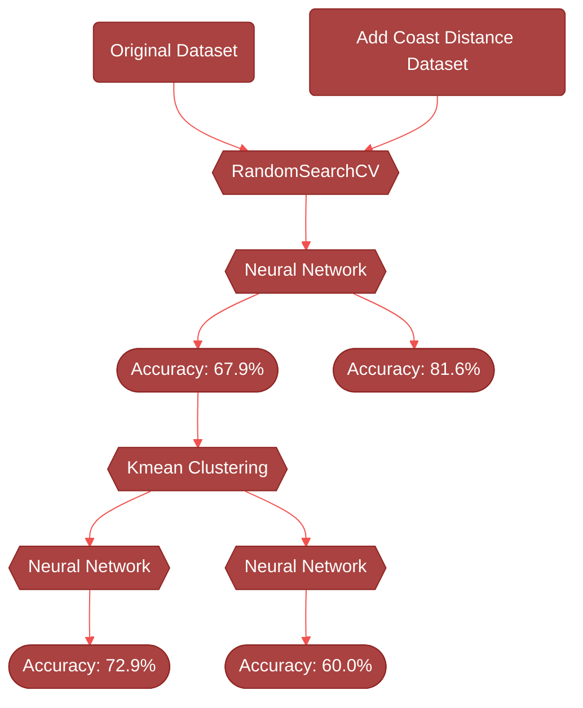

# Personal_website

```mermaid
%%{
  init: {
    'theme': 'base',
    'themeVariables': {
      'primaryColor': '#a94240',
      'primaryTextColor': '#fff',
      'primaryBorderColor': '#8f2624',
      'lineColor': '#f1524f'
    }
  }
}%%
flowchart TD
D1(Original Dataset) --> SE{{RandomSearchCV}} --> NN1{{Neural Network}} --> ML1([Accuracy: 67.9%]) --> C1{{Kmean Clustering}} --> N3{{Neural Network}} -->  ML2([Accuracy: 72.9%])
C1{{Kmean Clustering}} --> N2{{Neural Network}} --> ML3([Accuracy: 60.0%])
D2(Add Coast Distance Dataset) --> SE{{RandomSearchCV}}
NN1{{Neural Network}} --> ML4([Accuracy: 81.6%])
```